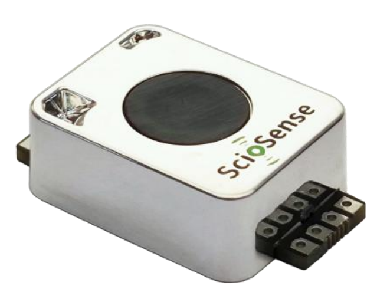
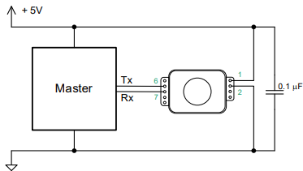

# ScioSense ENS190 NDIR CO₂ sensor
The ENS190 is a high-performance, non-dispersive infrared (NDIR) CO₂ sensor designed for precise and reliable carbon dioxide measurement.

<br><br>


ScioSense provides complete libraries for easy integration on their official [GitHub site](https://github.com/sciosense/ens190-arduino). However, if you prefer not to use a dedicated library, this repository offers a **simple way** to connect and work with the ENS190 sensor and can easily be adapted to various platforms. It includes a straightforward sample implementation for the ScioSense ENS190 device.
 
Find the full datasheet [here](https://www.sciosense.com/wp-content/uploads/2025/05/ENS190-Datasheet.pdf).
This code supports all essential functions for **RS232 communication**, including:

- Automatic baseline correction (**ABC**) parameters
- Setting alarm thresholds
- Manual CO₂ baseline adjustment
- Configuring baud rate
- Retrieving serial number
- Reading firmware version

---

## 🔌 Application circuit
 <br><br>

---

## 🖥️ Description
The code includes a **simple menu interface**, allowing you to **read and write all parameters** in an easy operation mode.
Enter the menu by typing `?` followed by **Carriage Return (CR)**.

### Menu Options

 ```
    Menu:
    m - start/stop measurement
    c - enter automatic baseline intervall [h] (24..4230)
    a - enter new baseline (>399)
    l - enter upper and lower alarm limit
    i - enter measurement interval
    r - get upper and lower alarm limit
    f - get firmware
    s - get serial number
    ? - this menue
 ```
---

## 🙌 Credits
Device, datasheet, pictures, and some text are property of **ScioSense B.V.**

---

## ⚠️ Warranty
This is a **private project**.  

No warranty or responsibility is assumed by using this code.
